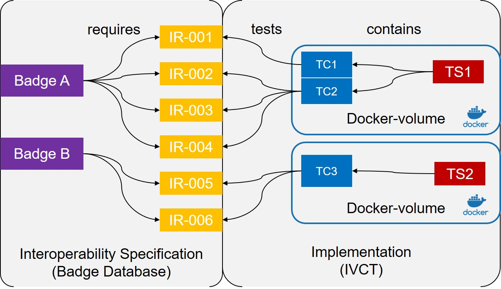
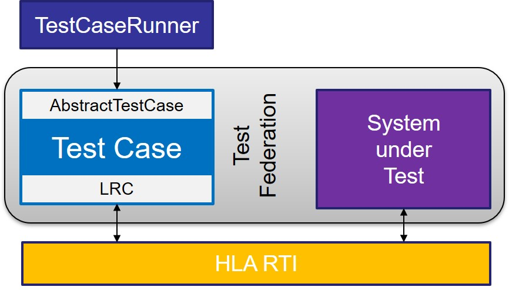

== What is a Test Case?

=== The Test Purpose

The test case development always starts with a purpose. The purpose of each test case is to test the interoperability of a *System under Test (SuT)*. In order to do this, the understanding of interoperability need to be defined. The IVCTool is using the concept if a *Interoperability Requirement (IR)* to define a specific requirement that a federate need to fullfill in order to be considered interoperable in a certain aspect. A IR can specify anything, starting from a simple object to be published, up to a certain behavior pattern to be compliant to.

IRs are as simple and atomic as possible, in order to be testable. They are compiled into sets of IRs, defined as interoperability patterns, called *Badges*. Such badges are used to express the capabilities of federates.

Test Cases may test one or more IRs, depending on the complexity of the IR and also on the dependency between IRs. It is considered as good practices to have one test case per IR. That reduces the complexity of the tests and provides more flexibility for the composition of badges.

The figure below shows links between badges, IR and TC. For deployment and maintaince reasons, the test cases are structured witin *Test Suites (TS)*. A TS is individual component, normally containerized in a docker image, and linked to the IVCTool.

=== The Test Case Federate

When we talk about a *Test Case (TC)* in the context of the IVCTool, we normal mean an program that can be executed to perform a test against a system to which it is connected. The system to be tested is called the *System under Test (SuT)*, and it is a federate in a federated simulation. The connection between the TC and the SuT is provided by a *HLA*-based *Run-Rime Infrastructure (RTI)*. The TC by itself is also a federate and all the testing will be done on top of HLA application programming interface (API).

In a more generic context, a test case would be distinguished into two forms. The specification the test algorithm is called *Abstract Test Case (ATC)* and the implementation of this algorithm is called *Executable Test Case (ETC)*. But because the IVCTool does not deal with any abstract test cases, whenever we talk about a test case, we are refering to the concept of an ETC.

The TC will be executed in a process called *Test Case Runner*. The runner is a IVCTool component, to load the TC code, to join the federation with the SuT, and finally to execute the tests.

The figure below shows the Test Case and its interfaces. Technically a test cases is just a federate like the SuT. It connects to the HLA Run-Time Infrastucture (RTI) like any other federate. The only difference is, that the TC will use a slightly extended version of the *Local RTI Component (LRC)* Interface. The LRC is extended to provide protocol information for each interface method.

The other interface a TC needs to implement is the *Abstract Test Case*. With that interface the test case runner actually controls the test case execution, like prepare, execute and cleanup.

=== The Test Case Interface

Each TC is implemented as a subclass of ``AbstractTestCase``, which is defined in the test case library. The main methods of this class are shown in the listing below. This interface is known by the runner and it is used to provide the TC with parameters, to prepare the execution, to execute the test and finally to perform any post actions to evaluate and to cleanup the test run.

.The Java Class AbstractTestCase
[source, java]
----
public abstract class AbstractTestCase {
  ...

  protected abstract IVCT_BaseModel getIVCT_BaseModel(
    final String tcParamJson, final Logger logger)
    throws TcInconclusive;

  protected abstract void performTest(
    final Logger logger)
    throws TcInconclusive, TcFailed;

  protected abstract void preambleAction(
    final Logger logger)
    throws TcInconclusive;

  protected abstract void postambleAction(
    final Logger logger)
    throws TcInconclusive;

  ...
}
----
