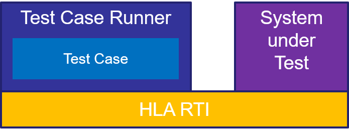

== What is a Test Case?

When we talk about a *Test Case (TC)* in the context of the IVCTool, we normal mean an program that can be executed to perform a test against a system to which it is connected. The system to be tested is called the *System under Test (SuT)*, and it is a federate in a federated simulation. The connection between the TC and the SuT is provided by a *HLA*-based *Run-Rime Infrastructure (RTI)*. The TC by itself is also a federate and all the testing will be done on top of HLA application programming interface (API).

In a more generic context, a test case would be distinguished into two forms. The specification the test algorithm is called *Abstract Test Case (ATC)* and the implementation of this algorithm is called *Executable Test Case (ETC)*. But because the IVCTool does not deal with any abstract test cases, whenever we talk about a test case, we are refering to the concept of an ETC.

The TC will be executed in a process called *Test Case Runner*. The runner is a IVCTool component, to load the TC code, to join the federation with the SuT, and finally to execute the tests.

.Test Federation Setup

=== The Test Case Programm

Each TC is implemented as a subclass of ``AbstractTestCase``, which is defined in the test case library. The main methods of this class are shown in the listing below. This interface is known by the runner and it is used to provide the TC with parameters, to prepare the execution, to execute the test and finally to perform any post actions to evaluate and to cleanup the test run.

.The Java Class AbstractTestCase
[source, java]
----
public abstract class AbstractTestCase {
  ...

  protected abstract IVCT_BaseModel getIVCT_BaseModel(
    final String tcParamJson, final Logger logger)
    throws TcInconclusive;

  protected abstract void performTest(
    final Logger logger)
    throws TcInconclusive, TcFailed;

  protected abstract void preambleAction(
    final Logger logger)
    throws TcInconclusive;

  protected abstract void postambleAction(
    final Logger logger)
    throws TcInconclusive;

  ...
}
----
