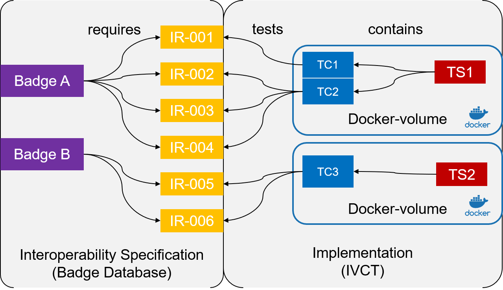

== Where to start when writing a test cases?

=== The Test Purpose

The purpose of each test case is to test the interoperability of a *System under Test (SuT)*. In order to do this, the understanding of interoperability need to be defined. The IVCTool is using the concept if a *Interoperability Requirement (IR)* to define a specific requirement that a federate need to fullfill in order to be considered interoperable in a certain aspect. A IR can be anything, starting from a simple object to be published, up to a certain behavior pattern to be compliant to.

IRs are as simple and atomic as possible, in order to be testable. They are compiled into sets of IRs, defined as interoperability patterns, called *Badges*. Such badges are used to express the capabilities of federates.

Test Cases may test one or more IRs, depending on the complexity of the IR and also on the dependency between IRs. It is considered as good practices to have one test case per IR. That reduces the complexity of the tests and provides more flexibility for the composition of badges.

The figure below shows links between badges, IR and TC. For deployment and maintaince reasons, the test cases are structured witin *Test Suites (TS)*. A TS is individual component, normally containerized in a docker image, and linked to the IVCTool.

.How to connect test suites to badges

=== Test case classes

- the purpose is to test interoperability requirements
- one test case for one requirement: this gives flexibility for combining
- support functions can be integrated

=== Test suites

- combining test cases and support libraries into one project
- compile with gradle,
- automate with travis
- integrate test suites into the IVCTool deployment

=== Containerize test suites

- docker containers
