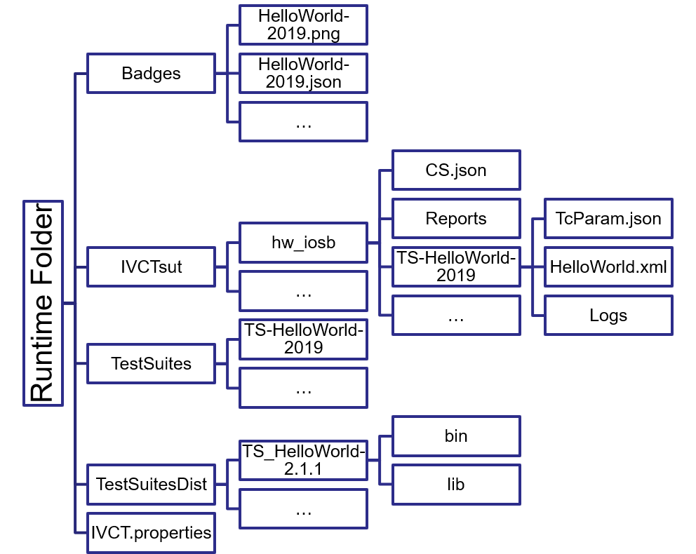

== How to Prepare your Development Environment?

Before you can start developing test cases, you need to decide what kind of run-time environment you like to have. There are some restrictions given by the IVCT design, such as the gradle build scripts and the run-time structure. But otherwise you are mostly free on what kind environment you are preferring.

=== Operating System

All IVCT components are pure Java and are tested on Linux and Windows 10.

=== IDE - Integrated Development Environment

IVCT is using the 'gradle' build system (see https://gradle.org/). That's an open source and widely used build system, which is supported by most IDE's. Within the IVCT community Eclipse and Netbeans is used, and we are not aware of any issues with other IDEs.

If like to the test engine from within your IDE, you need to include the LRC libraries from your HLA RTI. The different IDE's are providing several ways to do so, for Eclipse you may add a external jar file into the project class path if the TC.exec sub-project. For debugging purposes, you may also need to add the source path for the test cases, because the test cases libraries are loaded from within the test case engine, so the IDE does not know about the sources.

=== The HLA Run-Time Infrastructure

It is kind of obvious but should be mentioned nevertheless - for any HLA application you need a RTI. How to get and install an RTI your favorite RTI is out of scope for this documentation. From the software development point of view, you need a library for the HLA API to be linked to your application. This must be done in your IDE. If you are using the gradle build for creating a distribution, the library can be defined via the environment variable `LRC_CLASSPATH`. A typical setting for a windows user would be
----
set LRC_CLASSPATH="C:\Program Files (x86)\prti1516e\lib\prti1516.jar"
----

When using docker deployments, the RTI configuration is done by selecting the appropirate images, see https://github.com/hlacontainers/lrc for more information on that.

===  Run-time Folder

The IVCTool requires several configuration files and it creates protocol and report files. They all organized within several folders, where is folder is configurable (see https://github.com/IVCTool/IVCT_Framework/blob/development/docs/src/2-8-IVCT_Configuration.adoc for more details). However, a very typical and recommended structure is shown in the figure below.

- Badges: All badge definition files, as well as the badge key visuals, are stored in that folder. If a new badge shall be included, the user has to add the respective definition files here.
- IVCTsut: The definition and protocol files for System under Tests (SuT) are managed within this folder. It includes a conformance statement for each SuT, along  with subfolders for each test suite including test case parameters protocol files.
- TestSuites: The available test suites are configure within that folder. There is one json file for each test suite.
- TestSuiteDist: The actual implementations for the test suites are collected in that folder. The subfolder structure for each test suite is the same as the distribution, generated by the gradle build.
- IVCT.properties: Additional configurations are possible in a properties file. The location and also the name of that file is provides by the environment variable `IVCT_CONF`.

====  Building an example Runtime - Folder from scratch  by a  script

we provide  a script with which you can create a runable Runtime-Environment on a Linux operation system
as an example: +
link:scripts/a_buildung_IVCT-Runtime_from_scratch_2020-04-09.sh[buildung_IVCT-Runtime_from_scratch] +

and furthermore start-scripts  to start these new installation. +
link:scripts/x_RunIVCT_brf_2020-04-09.sh[x_RunIVCT.sh] +
link:scripts/x_tomcat-startscript_IVCTRuntime_ApacheTomcat8551_brf-20200409.sh[tomcat-startscript_IVCTRuntime.sh]

Prerequisites are only:

- installed Java
- downloaded  apache-tomcat and apache-activemq   binaries as  tar.gz or .zip (explainded in the script) 
- a local RTI

Many explanation and comments are helpful to see the organisation of the environment and to transfer this  installation Information to other operation systems.

For example here is a extract of the script  where we get and compile the IVCT_TestSuiteDevelopment

----
echo -e "\n##for compiling you may need a gradle.properties with:"
echo    "  ossrhUsername=XXX ossrhPassword=myPassword"
echo -e "  and possibly systemProp.http.proxyHost= systemProp.http.proxyPort= \n"

read -p "please copy one to ${IVCTTOOL_Dir} - [Enter]  to continue, 'ctrl-c' to stop here"

### IVCT_TestSuiteDevelopment       ### dectivate following after the first run
git clone  https://github.com/IVCTool/IVCT_TestSuiteDevelopment.git
cd IVCT_TestSuiteDevelopment
git checkout development
cp ${IVCTTOOL_Dir}/gradle.properties .
sudo chmod 744 gradlew
./gradlew install
cd ..
----

in the following part we copy builded  components to their final destination in the runtime folder

----
echo -e "## HelloWorld Simulator - Application from IVCT_TestSuiteDevelopment " 

HelloWorld_active=HelloWorld-2.1.1

## save the old Version
[ -d $RUNTIME_Dir/$HelloWorld_active ] && mv $RUNTIME_Dir/$HelloWorld_active/ $RUNTIME_Dir/${HelloWorld_active}_${datum}_${zeit}

## get the version
#HelloWorld_active=$(ls ${TestSuiteDevelopment_Dir}/HelloWorld/build/distributions |grep tar)
# it's possible that we have different Versions, so we decide which to use 
HelloWorldTar=${HelloWorld_active}.tar

echo -e "- extract $TestSuiteDevelopment_Dir/HelloWorld/build/distributions/$HelloWorldTar to $RUNTIME_Dir \n"

tar -xf $TestSuiteDevelopment_Dir/HelloWorld/build/distributions/$HelloWorldTar -C $RUNTIME_Dir

pushd $RUNTIME_Dir
ln -s ${HelloWorld_active} HelloWorld
popd
----

=== Starting the IVCT Components

==== To docker or not to docker?

The build scripts are supporting both, docker-based containerized as well as script based distributions. Code development can be done in both environments, its more a question of you preferences and coding conventions. Docker container are easier to migrate and preferable in multi-operation system environments. While with script based distributions there is just one level of complexity less.

Starting the IVCTool as a docker composition is explained in https://github.com/IVCTool/IVCT_Operation/blob/develop/docs/src/home.adoc

==== Using native host installation

When running the IVCT components without containerized compositions on your native host, you need to install 2 additional software packages for the deployments:

A. ActiveMQ (https://activemq.apache.org/). The communication between the IVCT components is done via a Java Message Service (JMS). The current development and tests are using the ActiveMQ implementation. Other JMS implementation should also work, but this is currently not tested.

B. Apache Tomcat (https://tomcat.apache.org/). The graphical user interface (GUI) is implemented as java web application. The current development and tests are using the Apache Tomcat implementation, but any web application engine should work. For the development in Eclipse currently the Jetty engine is used.

Deploying the software requires the following steps:

1. Start the JMS service (ActiveMQ): The simplest way to start the activemq server is to use the start script in the activemq bin folder, like `.\bin\activemq start`

2. Building the software: Start a command shell in the root folder of the IVCT_Framework repository and run `gradlew install`

3. Deploy the web applications within tomcat: There are 2 web applications which need to deployed inside the tomcat server. These are `nato.ivct.gui.server.app.war` and `nato.ivct.gui.html.app.war`. Deployment is simply copy the two war files into the webapp subfolder inside the tomcat installation. There are some additional configuration files you may replace inside the tomcat conf folder. These are the `server.xml` and the `tomcat-user.xml` file from the `IVCT_Framework/GUI/docker` folder. These are for adding a user setting and for making the ivct service the default path to simplify the web address. When starting the tomcat service after this deployment, the GUI will be available as `http://localhost:8080`

4. Start the logsink service: The logsink service collects trace messages and manages the protocol files and the reports. There is a zip and a tar archive with start a script inside the build folder `IVCT_Framework\LogSink\build\distributions`. For Windows you need to unzip the archive and you will find a bin folder with `LogSink.bat` sript

5. Start the TC.exec test case engine: The test case engine is needed to execute any test case. Again there is a zip and a tar archive inside the build folder `IVCT_Framework\TC.exec\build\distributions`. For Windows you need to start the `TC.exec.bat` script.
