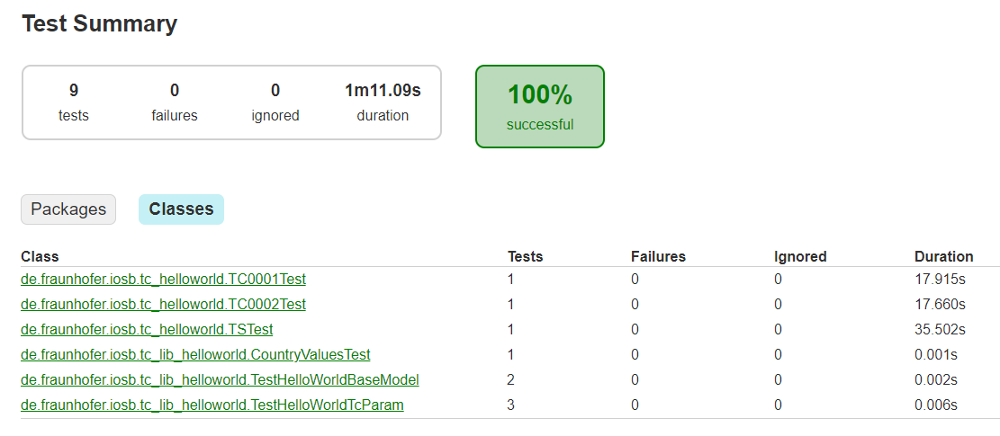

== Running and Testing the Test Cases

During the development of test cases, you will have to run and test your code. This will start with your first method and it will end with the execution of the test cases within the IVCT tool during a certification test. We recommend a test-driven development approach for all parts of you test case code, and also to include them into your normal build cycle. This helps to discovery any unexpected side effects during your coding, at the earliest possible point in time. 

[quote, Wikipedia, https://en.wikipedia.org/wiki/Test-driven_development]
Test-driven development (TDD) is a software development process that relies on the repetition of a very short development cycle: requirements are turned into very specific test cases, then the code is improved so that the tests pass. 

A second recommendation is to use https://junit.org/junit5/[JUnit tests]. Most development environments are providing support for JUnit tests as they are de facto standard for testing. When sharing test case code, the community will then be able to easily understand and use them.

When including test cases into your build process, the JUnit tests will serve as a _quality gate_ before deploying the test cases. A build system like gradle will included the Junit tests in the build loops and only of all tests are passed, the software will be deployed.

The figure below shows the most typical environments to run a test case. During the development of a test case, internal tests will be used test individual methods of the complete test cases. After finishing the development of the test cases, the test suite will be deployed into a IVCT installation. The recommended way is to create docker images and use them within composition files.

.Test Case Execution Environments
image:images/ts-test.png[Test Case Execution, 600]

=== Preconditions to start a Test Case

Test cases are designed to be created on demand within a test case engine. They need to be configured to test a certain system under test, within a given federation, connected with specific run-time infrastructure.

As a test case implements the _AbstractTestCase_ interface, it inherits a _execute_ method, to actually run the test case. The _Caller_ of this method needs to fulfill some requirements as described below. This Caller can be any program, like a JUnit test used by the test case developer, or the test case engine after the test suite is deployed in a IVCT installation.

In Detail, before executing a test case, the following preconditions need to be fulfilled.

1. The Local Runtime Component (LRC) Library need to be included in the Caller process. This can be done in several ways. the test case engine in a IVCT installation, will be pre-configured to a specific RTI product. A IDE can add a LRC library into the project class path.

2. The test case configuration settings must be defined. That can be done by using default values within the test case implementation, or by calling the _setter_ operations of test case:

** `testCase.setSettingsDesignator ("crcAddress=localhost:8989")`
** `testCase.setFederationName(federationName);`
** `testCase.setSutName("hw_iosb");`
** `testCase.setSutFederateName(sutName);`
** `testCase.setTcName(testSchedule[i].getClass().getName());`
** `testCase.setTsName(tsName);`

3. [Optional] Disable the operator message dialog. If the test case shall run in a non-interactive mode, the message dialog between the test case and the IVCT operator can be disabled. Consequently all operator messages within the test case will be skipped and the test case will not be delayed.
** `testCase.setSkipOperatorMsg(true);`

4. Providing the test case parameter values for the _execute_ call.

** `IVCT_Verdict verdict = testCase.execute(tcParamJsonString, tcLogger);`

The _tcParamJsonString_ is JSON formatted string with a list of name/value pairs. A simple example would look like the following:

----
String tcParamJsonString = "{\"growthRate\":\"1.0003\", \"SOMfile\": \"HelloWorld.xml\"}";
----

The second execute parameter is the logger object to be used by the test case to report on events during the test case execution. 

----
org.slf4j.Logger tcLogger = org.slf4j.LoggerFactory.getLogger(TC0001.class);
----

=== Using JUnit tests to execute a Test Case

When running a test, the execution environment for the unit to be tested need to be same as in the production environment. This can as simple as just calling a stateless method, or it may be a bit more complex, like connecting to a HLA run-time infrastructure and joining a given federation. As an IVCT test case is supposed to be executed within a test engine, this environment need to be emulated by a JUnit test. 

A Simple test for the test case TC0001 could look like the example below:

----
// test case settings
Logger runLogger = LoggerFactory.getLogger(TSTest.class);
String tcParamJson = "{ \"growthRate\" : \"1.0003\", \"SOMfile\":  \"HelloWorld.xml\" }";
String settingsDesignator = "(setqb RTI_tcpPort 4000) (setqb RTI_tcpForwarderAddr \"rtiexec\")";

@Test
void test() {
    TC0001 testCase = new TC0001();
    testCase.setSettingsDesignator(settingsDesignator);
    testCase.setFederationName("HelloWorld");
    testCase.setSutName("hw_iosb");
    testCase.setSutFederateName("A");           
    testCase.setTcName(TSTest.class.getName());
    testCase.setTsName("TS_HelloWord");
    testCase.setSkipOperatorMsg(true);
    IVCT_Verdict verdict = testCase.execute(tcParamJson, runLogger);
    runLogger.info("Test Case Verdict: {}", verdict);
    assertTrue(verdict.verdict == IVCT_Verdict.Verdict.PASSED);     
}
----

In order to execute the test below, it need to be build with an Local RTI Component (LRC) library. For the test suite example TS_HelloWorld, the gradle build script has added a dependency to the system environment variable _LRC_CLASSPATH_ which contains the file path to the LRC library to be used. 

----
testImplementation files("$System.env.LRC_CLASSPATH")
----

In the test example shown above, the operator message dialog has been disabled with the _setSkipOperatorMsg(true)_ call. This assumes that the conditions requested by the test instructions given by the test cases are fulfilled. In the case of the TC0001 this assumes that a federation with the joined SuT is running before the test cases is being started. 

The JUnit tests may be called within the IDE or directly with the gradle build system. It is possible to just run all tests defined within the _test_ source set, or individual tests by using regular expression.

----
gradlew test                    # running all test
gradlew test --tests *TC0001*   # running tests matching regular expression
----

This will create a test report, which can be found inside at _TS_HelloWorld\build\reports\tests\test_ and will like the example below:

.Test Case Execution Environments

The JUnit tests will also be executed within the gradle _build_ task. This is intended as a quality gate before deploying the test case code into IVCT installation. However, as explained earlier, this requires a installed RTI with a running federation and a joined SuT. This will be problematic within a Continuous Integration build loop. To allow the test suite to be tested on a build server, the following rule can be included in the JUnit test declaration:

----
@Test
@EnabledIfEnvironmentVariable(named = "LRC_CLASSPATH", matches = ".*")
void test() {
----

With the _EnabledIfEnvironmentVariable_ rule, the test will only be executed when the _LRC_CLASSPATH_ variable is defined. Which will not be the case on the build server. In the development environment the LRC library name must be defined, e.g.

----
$ set LRC_CLASSPATH=C:\MAK\makRti4.5\lib\hla.jar
----

=== Deploying the Test Case into a IVCT Installation
 
The ultimate purpose of a test case is to be deploy and used inside an IVCT installation. This will be done by adding the test suite with all including test cases into a IVCT runtime file system. The overall concept of the IVCT runtime is explained in section link:(2-0-Prepare-runtime.adoc)[How to Prepare your Development Environment?].

Deploying a test suite boils down to copy the distribution (inside folder _TS_HelloWorld/build/distributions_) created by the _gradle build_ task into the test suite distribution folder (_$IVCT_TS_HOME_ID_) inside your IVCT runtime. 

The configuration of the test case will then be done by using the GUI or the CLI, and the test case will be executed within the TC.exec.

 
