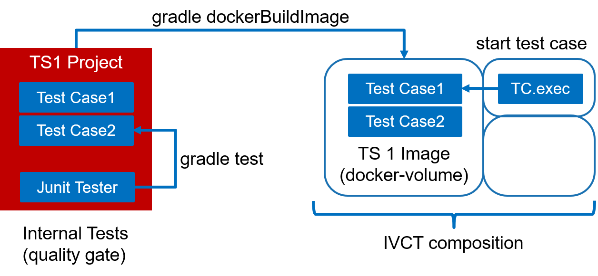

== Running the Test Cases

Up to this point, you should know about the basic concepts of a test cases. Now it is about time to actually run a test case.
As a test case implements the _AbstractTestCase_ interface, it inherits a _execute_ method. The _Caller_ of this method needs to fulfill some requirements as described below. This Caller can be anything, like a JUnit test used by the test case developer, or the test case engine after the test suite is deployed in a IVCT installation.

.Test Case Execution Environments

=== Preconditions to start a Test Case

Test cases are designed to be created on demand within a test case engine. They need to be configured to test a certain system under test, within a given federation, connected with specific run-time infrastructure.

In Detail, before executing a test case, the following preconditions need to be fulfilled.

1. The Local Runtime Component (LRC) Library need to be included in the Caller process. This can be done in several ways. the test case engine in a IVCT installation, will be pre-configured to a specific RTI product. A IDE can add a LRC library into the project class path.

2. The test case configuration settings must be defined. That can be done by using default values within the test case implementation, or by calling the _setter_ operations of test case:

** `testCase.setSettingsDesignator ("crcAddress=localhost:8989")`
** `testCase.setFederationName(federationName);`
** `testCase.setSutName("hw_iosb");`
** `testCase.setSutFederateName(sutName);`
** `testCase.setTcName(testSchedule[i].getClass().getName());`
** `testCase.setTsName(tsName);`

3. [Optional] Disable the operator message dialog. If the test case shall run in a non-interactive mode, the message dialog between the test case and the IVCT operator can be disabled. Consequently all operator messages within the test case will be skipped and the test case will not be delayed.
** `testCase.setSkipOperatorMsg(true);`

4. Providing the test case parameter values for the _execute_ call.

** `IVCT_Verdict verdict = testCase.execute(tcParamJsonString, tcLogger);`

The _tcParamJsonString_ is JSON formatted string with a list of key/value pairs. A simple example would look like the following:

----
String tcParamJsonString = "{\"growthRate\":\"1.0003\", \"SOMfile\": \"HelloWorld.xml\"}";
----

The second execute parameter is the logger object to be used by the test case to report on events during the test case execution. 

----
org.slf4j.Logger tcLogger = org.slf4j.LoggerFactory.getLogger(TC0001.class);
----

=== Using JUnit tests to execute a Test Case

explain about testing the test cases
internal quality gate - continuous integration with gradle test
build distribution restricted to test case code
test environment with runtime sandbox

running all tests 

----
gradle test
----

running single test, e.g. TC0002Test by using the regular expression

----
gradle test --tests *TC0002*
----

=== Deploying the Test Case into a IVCT Installation
 
explain about gradle dockerBuildImage
integrate test suite distribution into IVCT composition or into runtime filesystem
configure parameter with GUI or CLI

 
