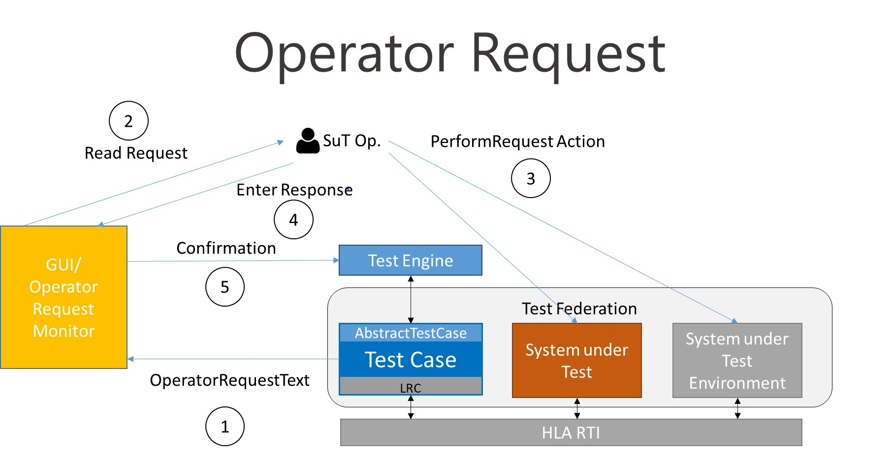

== Operator Request

=== Motivation

Some testcases require a dynamic reaction from the SUT which cannot be automated. The test case writer knows what the SUT has to do at a certain point of the test: the testcase needs to make a request to the SUT Operator and wait until the SUT Operator confirms that the required action or configuration has been performed.

.Operator Request Sequence Diagram

=== Usage

The method sendOperatorRequest(String operatorRequestText) provided by IVCT TC.lib AbstractTestCase can be called within a testcase to send the operatorRequestText via the JMS bus to the GUI/OperatorRequestMonitor processes. The operatorRequestText will be shown on the GUI/OperatorRequestMonitor and the testcase will wait until the SUT Operator confirms the request on the GUI/OperatorRequestMonitor console.

=== Implementation

Each testcase must have a unique identifier associated with it. The `sendOperatorRequest(String operatorRequestText)` will put the SUT name, the unique testcase identifier and the operatorRequestText into a JSON string and send it to the GUI/OperatorRequestMonitor via the JMS bus, where it will be displayed. The method will wait on a semaphore, halting the testcase until a confirmation by SUT Operator has been received from the OperatorRequestMonitor. Upon receiving the confirmation with the corresponding unique testcase identifier, the TC.exec TestEngine will release the semaphore associated with the testcase, allowing the testcase to continue.

==== Unique Testcase Identifier

The value of this identifier has to be unique among all testcases running. The fully qualified testcase name may not sufficient, since the same testcase may be started more than once and be running in parallel. Currently the same testcase name cannot run in parallel.

==== Operator Request Text

The test case writer knows when a synchronization between the testcase and SUT is required. At the appropriate position in the testcase, the test case writer will put the `sendOperatorRequest(String operatorRequestText)` with the instructions to the SUT operator explaining what action has to be taken by the SUT operator.

The message to the operator must be simple text message, where only line breaks (`'\n'`) are allowed to format the text.

==== Confirmation

The confirmation is created when SUT Operator responds to the operatorRequest in the GUI/OperatorRequestMonitor. A JSON string with the Unique Testcase Identifier, a boolean value (true means continue with the testcase, false means end the testcase) and a log message (additional fields may be included later) is then sent onto the JMS bus. The confirmation from the SUT Operator is only acted on by the testcase sending the operatorRequest. It may be useful to enable an automatic confirmation reply for tests where the SUT only needs to be started once for all tests.

==== Testcase Semaphore

The semaphore is created within the TC.exec TestEngine and given to the TC.lib AbstractTestCase base class for use by the testcase. In the TestEngine, a map <TestCaseIdentifier, SemaphoreID> will provide the mapping of the confirmation received in the TestEngine to the correct semaphore. The semaphore will then be released and the testcase able to continue.

=== Example: Test Case / SUT Synchronization

Each testcase has the requirement either that the SUT is running before or after the testcase is started. The testcase may need to observe actions at the beginning of an execution, in this case a SUT that is already running may have already completed this phase making the test useless. If the testcase makes observations for a limited period of time, the SUT must already be running or the testcase may time out before any observation is made.

In either case, it is useful to make a request to the test operator to ensure that the SUT is correctly started for the test. The `sendOperatorRequest(String operatorRequest)` will be placed at beginning the `preambleAction()` method of the testcase to achieve the testcase/SUT synchronization.

=== JSON samples

==== operatorRequest

	 { 
	    "commandType":"operatorRequest",
	    "sequence":"0",
	    "testCaseId":"TC0002",
	    "text":"Start SUT"
	 }

==== operatorConfirmation

  { 
	    "commandType":"operatorConfirmation",
	    "sequence":"0",
	    "testCaseId":"TC0002",
	    "positiveConfirmation":"true",
	    "text":"SUT started"
	 }
